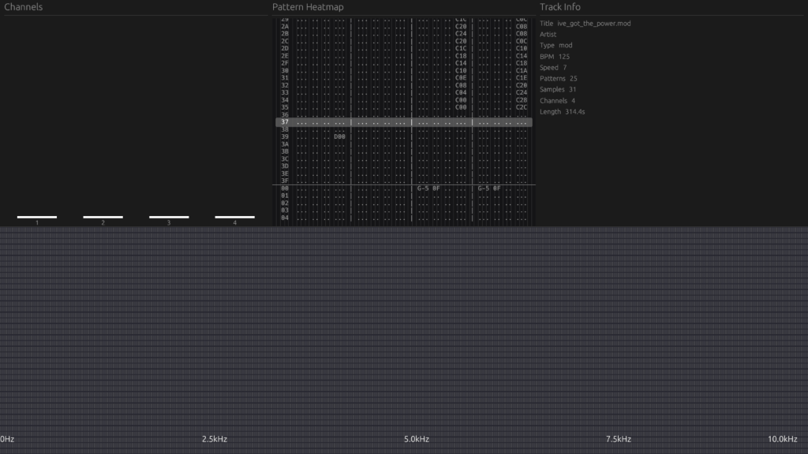

# RustTracker 🎵



A high-performance, real-time audio visualizer and tracker module player built in Rust. 

RustTracker leverages a **3-Thread DSP Architecture** to ensure zero-latency audio playback while simultaneously computing Fast Fourier Transforms (FFT) and rendering beautiful, fluid visualizations at 60FPS.

## Features

* **Real-time Tracker UI:** Seamlessly decodes and visualizes `.mod` files, rendering a classic piano-roll style pattern editor that aligns perfectly with the audio playback, complete with flawless cross-pattern scrolling and jumping.
* **Vertical Acoustic Heatmap:** A continuous waterfall spectrogram mapping the frequencies of the audio in real-time.
* **Graceful Degradation:** Supports playing standard audio files (`.mp3`, `.flac`, etc.) or capturing live microphone input (`--mic`), instantly adapting the UI to remove tracker elements and focus on acoustic analysis.
* **Zero-Latency Architecture:**
  * **Audio Thread (`cpal`):** A lock-free, ultra-high-priority thread dedicated solely to IO, preventing stuttering and audio underruns.
  * **DSP Thread:** A background worker that computes windowing and FFT spectrum data without blocking the audio stream.
  * **GUI Thread (`wgpu` + `egui`):** Hardware-accelerated UI rendering.

## Quick Start

Run a tracker module:
```bash
cargo run -- path/to/your_file.mod
```

Run with live microphone input:
```bash
cargo run -- --mic
```

## Built With
* `wgpu` & `egui` - Hardware-accelerated UI
* `cpal` - Cross-platform Audio I/O
* `spectrum-analyzer` - Fast Fourier Transforms
* `crossbeam-channel` - Lock-free concurrency
* `openmpt` - Tracker module decoding
