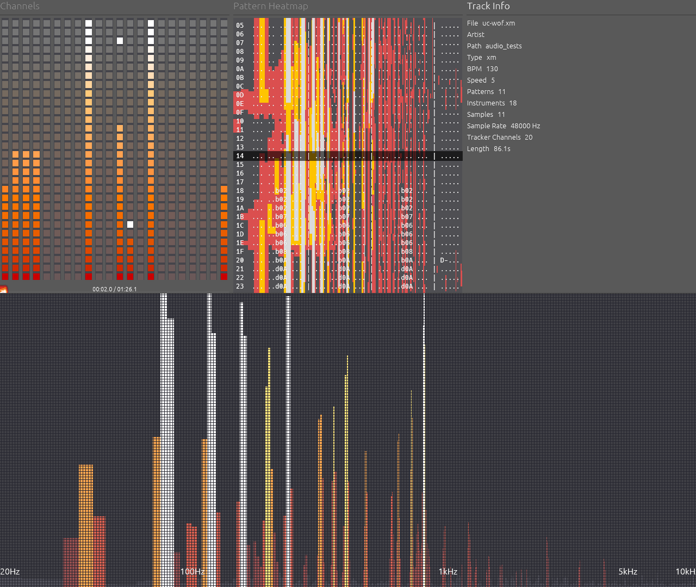
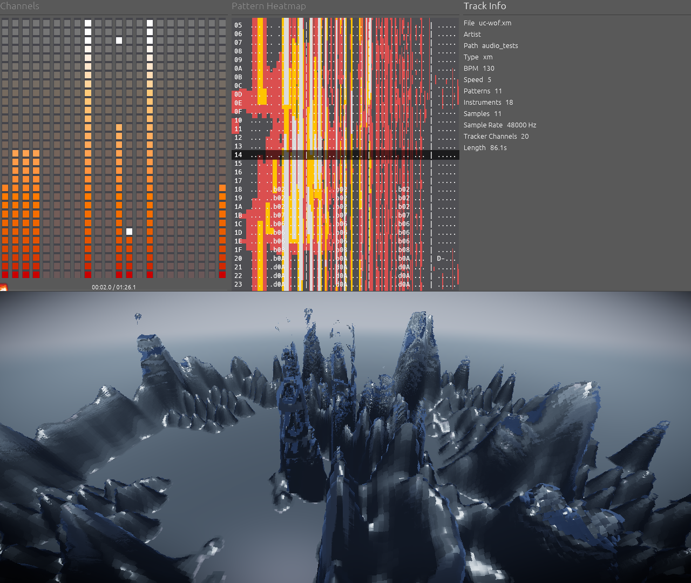
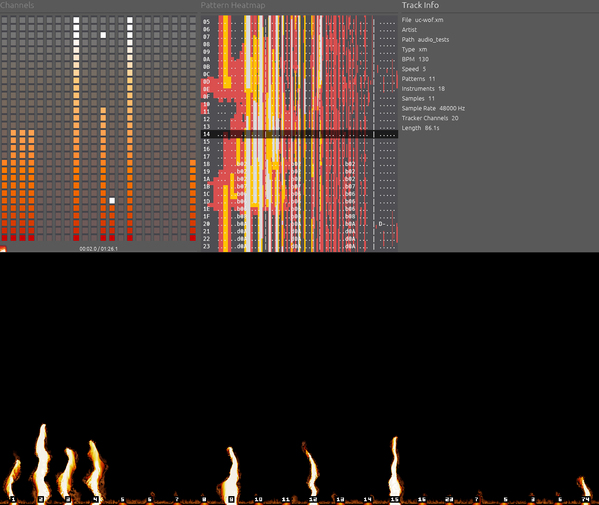
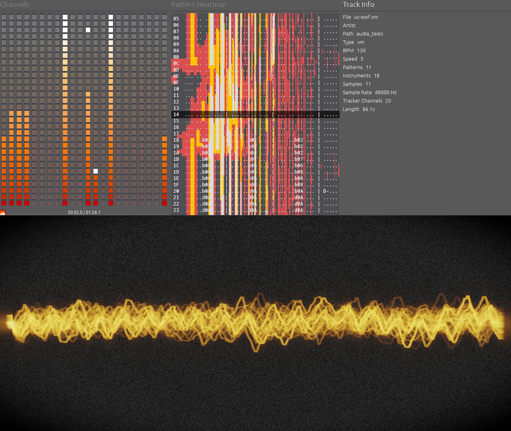

# RustTracker 🎵



A high-performance, real-time audio visualizer and tracker module player built in Rust. 

RustTracker leverages a **3-Thread DSP Architecture** and **Hardware-Accelerated Compute Shaders** to ensure zero-latency audio playback while simultaneously computing **GPU-accelerated Fast Fourier Transforms (FFT) on each spatial audio channel** to render beautiful, fluid visualizations at 120FPS.

## Visualizations

RustTracker includes a variety of WGPU-accelerated visualizations, combining classic demoscene aesthetics with modern procedural generation.

| Photorealistic Ferrofluid | Multi-Channel 3D Fire |
| :---: | :---: |
|  |  |

| CRT Oscilloscope | Frequency Spectrum |
| :---: | :---: |
|  |  |

## Features

* **Advanced Visualizers:** High-fidelity, cinematic shaders mapped tightly to precise acoustic frequencies.
* **GPU-Accelerated FFT:** Offloads audio-reactive spatial weights directly to the GPU using WGPU compute shaders, mapping individual surround-sound speaker channels to local geometry in real-time.
* **Cinematic Video Integration & HDR:** Features integrated hardware-accelerated video stream playback, rendering vibrant visual environments with HDR color precision.
* **Real-time Tracker UI:** Seamlessly decodes and visualizes `.mod` files, rendering a classic piano-roll style pattern editor that aligns perfectly with the audio playback, complete with flawless cross-pattern scrolling and jumping.
* **Graceful Degradation:** Supports playing standard audio/video files (`.mp3`, `.flac`, `.mp4`, `.mkv`, etc.) or capturing live microphone input (`--mic`), instantly adapting the UI to remove tracker elements and focus on acoustic analysis.
* **Zero-Latency Architecture:**
  * **Audio Thread (`cpal`):** A lock-free, ultra-high-priority thread dedicated solely to IO, preventing stuttering and audio underruns.
  * **DSP Thread:** A background worker that computes windowing and frequency history data without blocking the audio stream.
  * **GPU Render Pipeline (`wgpu` + `egui`):** Low-overhead, high-performance hardware rendering.

## Quick Start

Run a tracker module:
```bash
cargo run -- path/to/your_file.mod
```

Run with live microphone input:
```bash
cargo run -- --mic
```

## Linux Installation

RustTracker provides pre-compiled AppImages, RPM, and DEB packages via the **Releases** page.

### Steam Deck (AppImage)
1. Download `RustTracker-SteamDeck-GamePad.AppImage` in Desktop Mode.
2. Mark it as executable (`Properties` -> `Permissions` -> `Is executable`).
3. Add to Steam and launch in **Gaming Mode** for native Gamepad support.
*(To force Gamepad Mode in Desktop Mode, hold the **Start (Menu)** button for 3 seconds)*

### RPM / DEB Packages
Install the downloaded packages using your native package manager:
- **Fedora/RHEL:** `sudo dnf install ./RustTracker-Linux*.rpm`
- **Ubuntu/Debian:** `sudo dpkg -i ./RustTracker-Linux*.deb`

### Building Packages from Source
To build the packages yourself, install the necessary dependencies:

**For RPM (Fedora):**
```bash
sudo dnf install -y gcc gcc-c++ binutils pkgconfig alsa-lib-devel wayland-devel libX11-devel libxkbcommon-devel systemd-devel ffmpeg-devel libopenmpt-devel clang clang-devel
cargo install cargo-generate-rpm
cargo build --release
strip target/release/rusttracker
cargo generate-rpm
```

**For DEB (Ubuntu/Debian):**
```bash
sudo apt-get install -y gcc g++ binutils pkg-config libasound2-dev libwayland-dev libx11-dev libxkbcommon-x11-dev libudev-dev libavcodec-dev libavformat-dev libavutil-dev libavdevice-dev libavfilter-dev libopenmpt-dev clang libclang-dev
cargo install cargo-deb
cargo build --release
strip target/release/rusttracker
cargo deb
```

## Built With
* `wgpu` & `egui` - Hardware-accelerated UI
* `cpal` - Cross-platform Audio I/O
* `spectrum-analyzer` - Fast Fourier Transforms
* `crossbeam-channel` - Lock-free concurrency
* `openmpt` - Tracker module decoding
