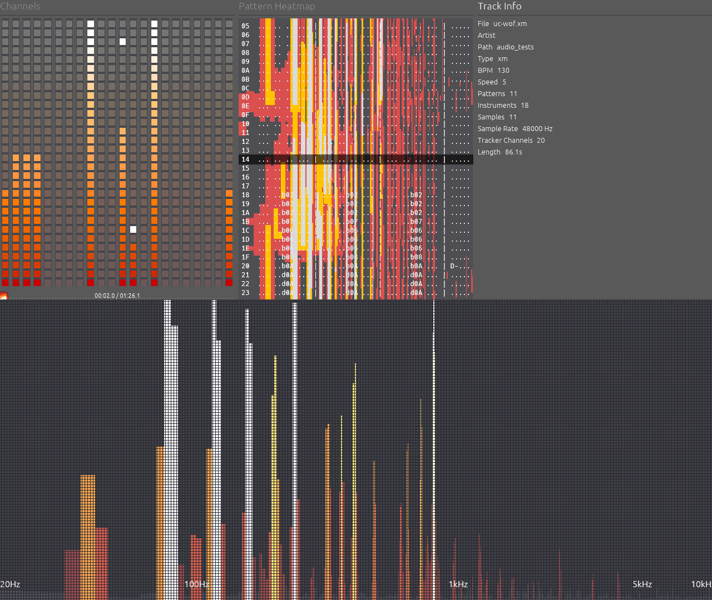
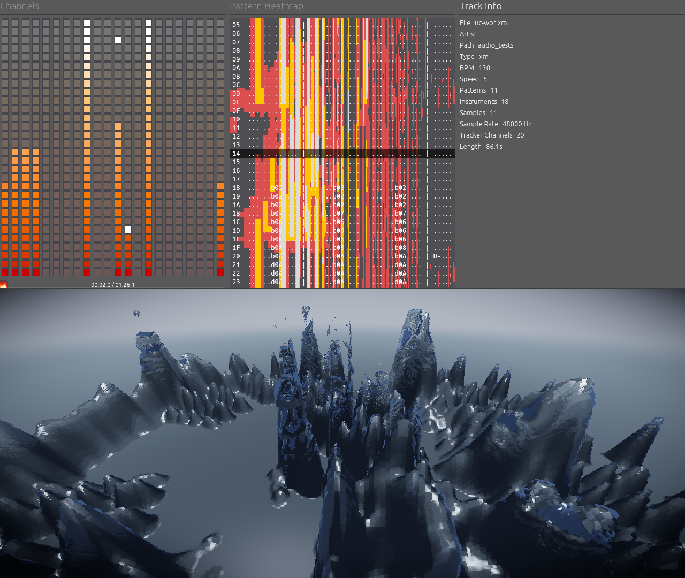
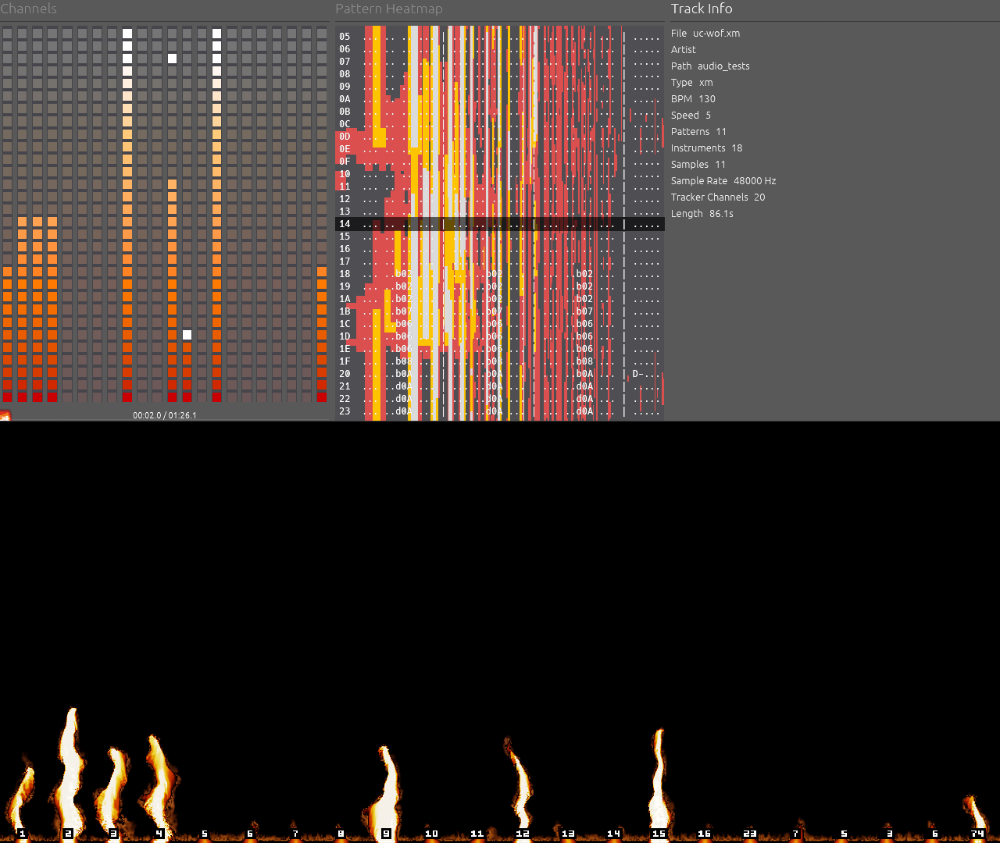
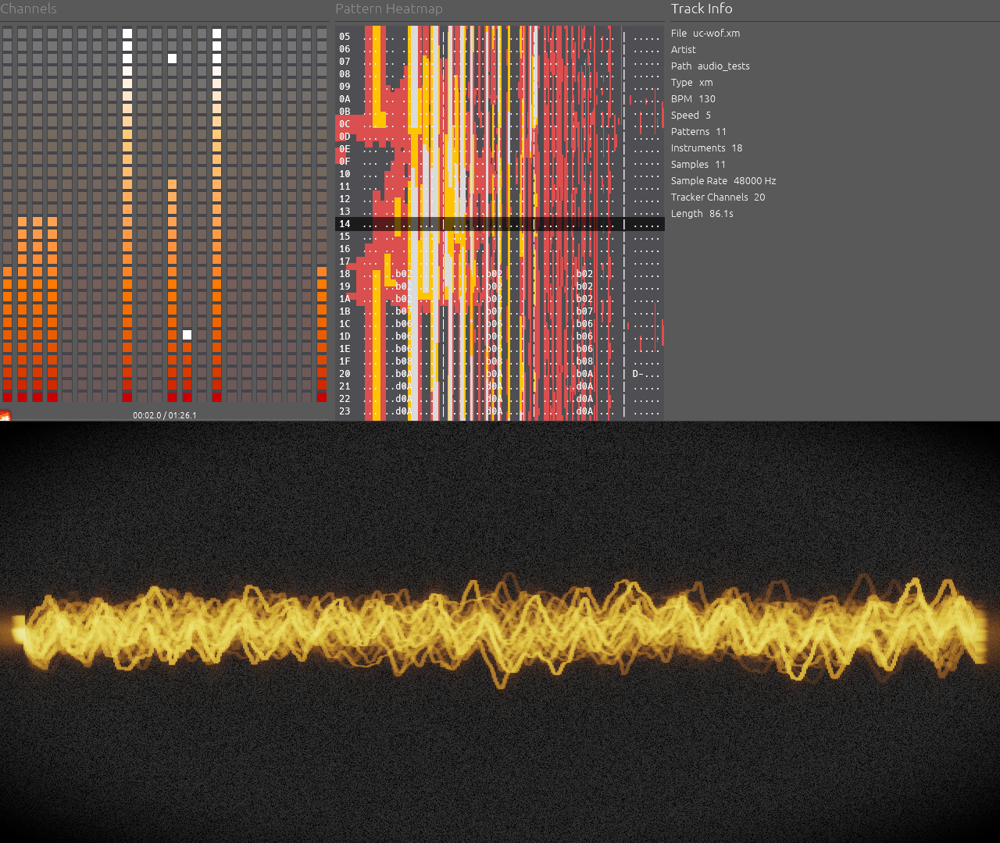

# RustTracker 🎵🦀



A high-performance, real-time audio visualizer and tracker module player built in Rust. Because your eyes deserve to hear the music too, and because I wanted an excuse to do something in Rust.

RustTracker leverages a **3-Thread DSP Architecture** and **Hardware-Accelerated Compute Shaders** to ensure zero-latency audio playback while simultaneously computing **GPU-accelerated Fast Fourier Transforms (FFT) on each spatial audio channel**. It renders beautiful, fluid visualizations at a buttery-smooth high framerates.

Supported formats include all the best ones; .MOD, .S3M, .IT, and .XM!. Lossless formats such as FLAC, WAV. And of course, your everyday MP3. It even supports video files and bitstreaming/passthrough for proprietary formats like Dolby Atmos, DTS-HD, etc. 

## Visualizations

RustTracker includes an array of WGPU-accelerated visualizations. It's like the 90s, but with way more teraflops.

| Photorealistic Ferrofluid | Multi-Channel 3D Fire |
| :---: | :---: |
|  |  |

| CRT Oscilloscope | Frequency Spectrum |
| :---: | :---: |
|  |  |

## Features

* **Advanced Visualizers:** High-fidelity, cinematic shaders mapped tightly to precise acoustic frequencies. Prepare to be mesmerized.
* **GPU-Accelerated FFT:** We offload audio-reactive spatial weights directly to the GPU using WGPU compute shaders because your CPU is busy enough.
* **Cinematic Video Integration & HDR:** Features integrated hardware-accelerated video stream playback, rendering vibrant visual environments with HDR color precision.
* **Real-time Tracker UI:** Seamlessly decodes and visualizes `.mod` files, rendering a classic piano-roll style pattern editor. It aligns perfectly with the audio playback, complete with flawless cross-pattern scrolling and jumping.
* **Graceful Degradation:** Supports playing standard audio/video files (`.mp3`, `.flac`, `.mp4`, `.mkv`, etc.) or capturing live microphone input (`--mic`). It instantly adapts the UI to remove tracker elements and focus on acoustic analysis. It's smart like that.

## Performance & Architecture

RustTracker is designed to be blazingly fast and utterly relentless when it comes to performance. 

* **Audio Thread (`cpal`):** A lock-free, ultra-high-priority thread dedicated solely to IO. It pushes audio buffers like its life depends on it, preventing stuttering and audio underruns.
* **DSP Thread:** A background worker that computes windowing and frequency history data. It does the heavy mathematical lifting without ever daring to block the audio stream.
* **GPU Render Pipeline (`wgpu` + `egui`):** Low-overhead, high-performance hardware rendering that talks directly to your graphics card, bypassing the slow lane.

## Quick Start

Run a tracker module (and prepare to groove):
```bash
cargo run -- path/to/your_file.mod
```

Run with live microphone input (try whistling):
```bash
cargo run -- --mic
```

## Linux Installation

RustTracker provides pre-compiled AppImages, RPM, and DEB packages via the **Releases** page, because we know compiling from source isn't everyone's idea of a fun Friday night.

### Steam Deck (AppImage)
1. Download `RustTracker-SteamDeck-GamePad.AppImage` in Desktop Mode.
2. Mark it as executable (`Properties` -> `Permissions` -> `Is executable`).
3. Add to Steam and launch in **Gaming Mode** for native Gamepad support.
*(To force Gamepad Mode in Desktop Mode, hold the **Start (Menu)** button for 3 seconds. It's a secret to everybody.)*

### RPM / DEB Packages
Install the downloaded packages using your native package manager:
- **Fedora/RHEL:** `sudo dnf install ./RustTracker-Linux*.rpm`
- **Ubuntu/Debian:** `sudo dpkg -i ./RustTracker-Linux*.deb`

### Building Packages from Source
If compiling from source *is* your idea of a fun Friday night, install the necessary dependencies and go wild:

**For RPM (Fedora):**
```bash
sudo dnf install -y gcc gcc-c++ binutils pkgconfig alsa-lib-devel wayland-devel libX11-devel libxkbcommon-devel systemd-devel ffmpeg-devel libopenmpt-devel clang clang-devel
cargo install cargo-generate-rpm
cargo build --release
strip target/release/rusttracker
cargo generate-rpm
```

**For DEB (Ubuntu/Debian):**
```bash
sudo apt-get install -y gcc g++ binutils pkg-config libasound2-dev libwayland-dev libx11-dev libxkbcommon-x11-dev libudev-dev libavcodec-dev libavformat-dev libavutil-dev libavdevice-dev libavfilter-dev libopenmpt-dev clang libclang-dev
cargo install cargo-deb
cargo build --release
strip target/release/rusttracker
cargo deb
```

## Built With (The Shoulders of Giants)
* `wgpu` & `egui` - Hardware-accelerated UI that makes things pretty
* `cpal` - Cross-platform Audio I/O that makes things loud
* `spectrum-analyzer` - Fast Fourier Transforms that make the pretty things react to the loud things
* `crossbeam-channel` - Lock-free concurrency because threads should get along
* `openmpt` - Tracker module decoding for that sweet, sweet nostalgia

## License

This project is licensed under the [GNU General Public License v3.0](LICENSE) (GPLv3).
